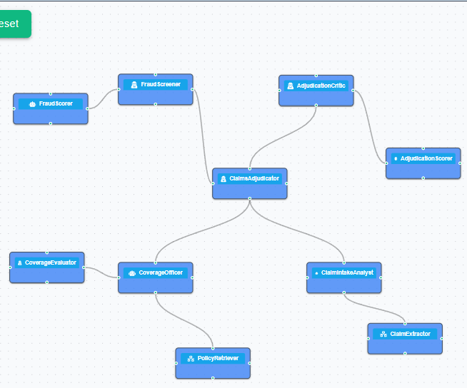

# Claims Triage Assistant
### A governed, human-in-the-loop agent network on Neuro SAN

A multi-agent system, built on [Neuro SAN Studio](https://github.com/cognizant-ai-lab/neuro-san-studio),
that triages an insurance claim against the policy and recommends **pay / deny /
investigate** — with the coverage math done deterministically, fraud red-flags
screened in code, claimant PII kept off the LLM, and an **adjuster approval gate**
before any disposition is final.

Insurance also makes the governance pieces *intrinsic* rather than optional: these are
regulated, auditable decisions, so the **evaluation loop** (a critic that re-checks
the disposition) and the **human approval gate** are core value, not garnish — and the
privacy story (PII/PHI/bank data never reaches the model) is a real differentiator.

---

## Project Files

README  : [README.md](./README.md)  
Summary : [hackathon_docs/summary.md](./hackathon_docs/summary.md)  
Architecture : [hackathon_docs/architecture.md](./hackathon_docs/architecture.md)

Agent Network Hocon    : [registries/hackathon/claims_triage_assistant.hocon](./registries/hackathon/claims_triage_assistant.hocon)    
Agent Network Manifest : [registries/hackathon/manifest.hocon](./registries/hackathon/manifest.hocon)    
Coded Tools : [coded_tools/hackathon/claims_triage_assistant](./coded_tools/hackathon/claims_triage_assistant)    

Evals: [hackathon_evals/run_eval.py](./hackathon_evals/run_eval.py)   
Tests: [hackathon_tests/test_claims_triage.py](./hackathon_tests/test_claims_triage.py)



## What it does

Given a claim (a synthetic First Notice of Loss is included) and the policy, the network:

1. **Extracts the claim facts** (peril, dates, amount, description) and **redacts PII
   and bank details** into `sly_data`.
2. **Adjudicates coverage** against the policy: was it in force on the loss date, is
   the peril covered, does any **exclusion** apply, and what is **payable** after the
   **limit** and **deductible** — all computed deterministically.
3. **Screens for fraud** with deterministic red-flag rules (late reporting, loss near
   inception/expiry, amount at/over limit, round-number amounts), producing a band
   and an SIU-referral recommendation.
4. **Checks the disposition** (the evaluation loop): clear recommendation, cited
   coverage/exclusion basis, payable matches the computed figure, limit/deductible
   disclosed, and SIU routing when fraud risk is High.
5. Presents a **draft pending adjuster approval** and waits for approve / request
   changes / reject. Only on approval is the disposition final.

On the included sample claim — a $48,000 burst-pipe water-damage loss — the engine
recommends **PAY $39,000** (the claim is capped at the $40,000 water sub-limit, less
the $1,000 deductible), cites the governing coverage, flags two **low** fraud
indicators (no SIU), and routes to the adjuster for sign-off. The test suite also
exercises a **DENY** (flood exclusion) and an **INVESTIGATE** (high fraud) path.

---

## Architecture

```
Claim (FNOL)
    │
    ▼
ClaimsAdjudicator  ← front-man / orchestrator (AAOSA routing, owns the loop + approval gate)
    ├── ClaimIntakeAnalyst ───► ClaimExtractor       (coded tool: parse FNOL + redact PII → sly_data)
    ├── CoverageOfficer ──────► PolicyRetriever        (coded tool: policy provisions = grounding)
    │                           CoverageEvaluator      (coded tool: in-force/peril/exclusions + payable math)
    ├── FraudScreener ────────► FraudScorer            (coded tool: deterministic red-flag scoring)
    └── AdjudicationCritic ───► AdjudicationScorer     (coded tool: completeness/grounding → eval loop)
                                       │
                                       ▼
                          Draft → adjuster approval gate → FINAL DISPOSITION

sly_data carries the raw claim + claimant PII and bank details privately; the LLM
only ever sees redacted text ([CLAIMANT], [POLICY_NO], [ADDRESS], [BANK_ACCOUNT], ...).
```

Five LLM agents + five coded tools. See [hackathon_docs/architecture.md](./hackathon_docs/architecture.md) for detail.

---

## Repository layout

```
registries/
  claims_triage_assistant.hocon    # the agent network (AAOSA + coded-tool wiring)
  manifest.hocon               # the one line to add to your manifest
coded_tools/claims_triage_assistant/
  claim_extractor.py               # parse FNOL + redact PII/bank into sly_data
  policy_retriever.py              # retrieve policy provisions (grounding)
  coverage_evaluator.py            # deterministic coverage decision + payable math
  fraud_scorer.py                  # deterministic fraud red-flag scoring
  adjudication_scorer.py           # completeness/grounding check that powers the eval loop
  data/
    policy.json                    # synthetic homeowners policy (coverages, exclusions, conditions)
    sample_claim.txt               # synthetic FNOL with PII and a covered-but-capped loss

  hachathon_tests/test_claims_triage.py        # deterministic offline tests (PAY / DENY / INVESTIGATE)
  hackathon_evals/run_eval.py                   # offline evaluation runner
```

---

## Setup — installing into a Neuro SAN Studio clone

These files are an **overlay** for a `neuro-san-studio` checkout.

1. **Clone the framework and create the environment** (per the repo's README):

   ```bash
   git clone https://github.com/cognizant-ai-lab/neuro-san-studio
   cd neuro-san-studio
   python -m venv venv && source venv/bin/activate && export PYTHONPATH=`pwd`
   pip install -r requirements.txt
---

## Run

```bash
python -m neuro_san_studio run
```

Open <http://localhost:4173/> and pick **claims_triage_assistant** from the network list.

Send the claim through the **sly_data** field, so the claimant's PII never enters the
LLM stream. In the UI's sly_data box, paste:

```json
{ "claim_text": "{"claim_text": "FIRST NOTICE OF LOSS (FNOL) — SYNTHETIC SAMPLE (NOT A REAL CLAIM)\n\nPolicy Number: HO-2025-558831\nPolicy Type: Homeowners\nClaimant: Satya Nayak\nAddress: 1122, Prestige Greenfield, Bengaluru-49\nPhone: 1234567890\nEmail: satya.nayak@example.com\nPayout Account (IBAN): GB29 NWBK 6016 1331 9268 19\nDate of Loss: 2026-02-12\nDate Reported: 2026-02-20\nPeril: Water damage (burst pipe)\nAmount Claimed: $48,000\nLocation of Loss: 1122, Budigere Cross, Bengaluru\nDescription: A pipe burst in the upstairs bathroom, suddenly discharging water that damaged the floors and the ceiling in the room below. The burst was discovered the same day and a plumber stopped it immediately. The claimant is seeking the cost of drying, repairs, and replacement of damaged flooring.\n"}" }
```

Then send a message such as: *"Triage this claim and recommend a disposition."*

The adjudicator will extract the facts, adjudicate coverage, screen for fraud, draft a
disposition, run the critic, and then ask you to **approve / request changes / reject**.
Reply `approve` to get the final disposition, or `request changes to the fraud assessment`
to see it loop.

---

## Test and evaluate (offline, no API key needed)

The grounding layer is fully testable without an LLM:

```bash
python hackathon_tests/test_claims_triage.py     # or: pytest tests/
python hackathon_evals/run_eval.py                # prints the coverage decision, payable, and fraud screen
```

These prove the PII redaction, the coverage math ($39,000 payable on the sample), the
fraud bands, and all three dispositions (PAY / DENY / INVESTIGATE).

---
